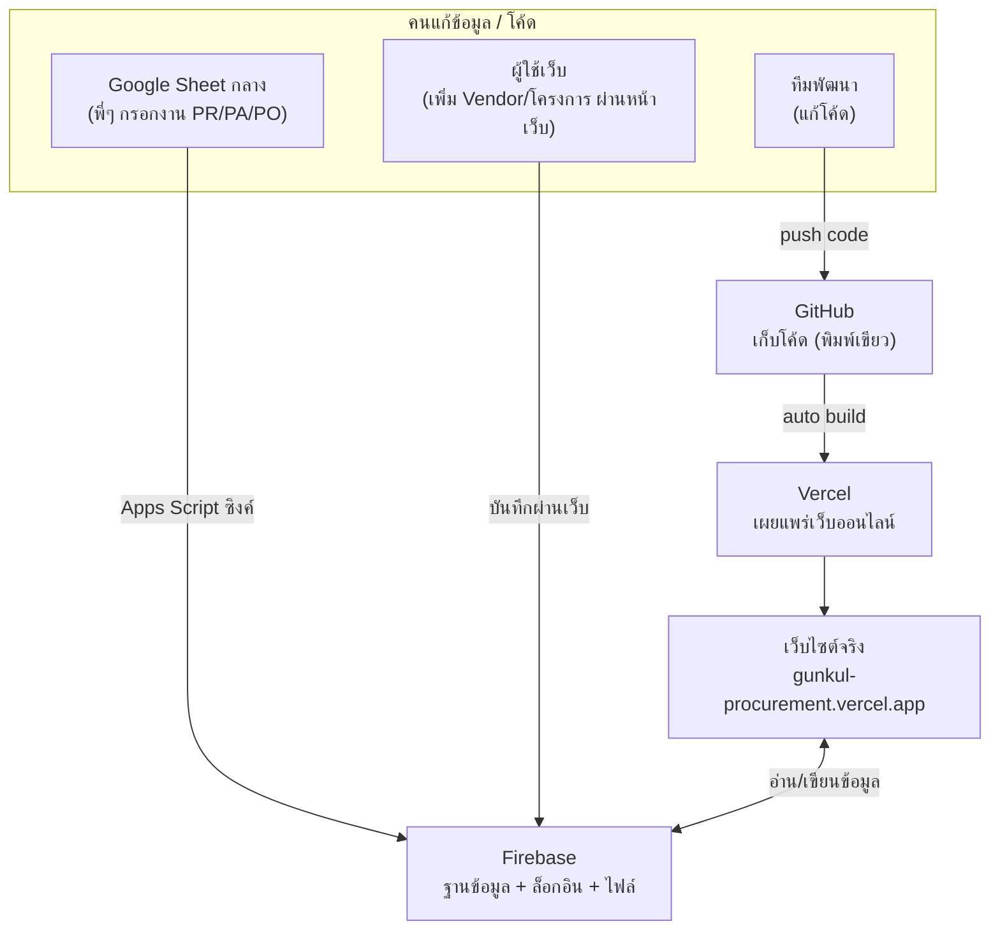
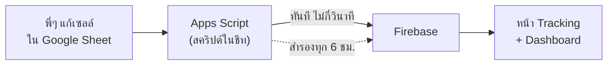
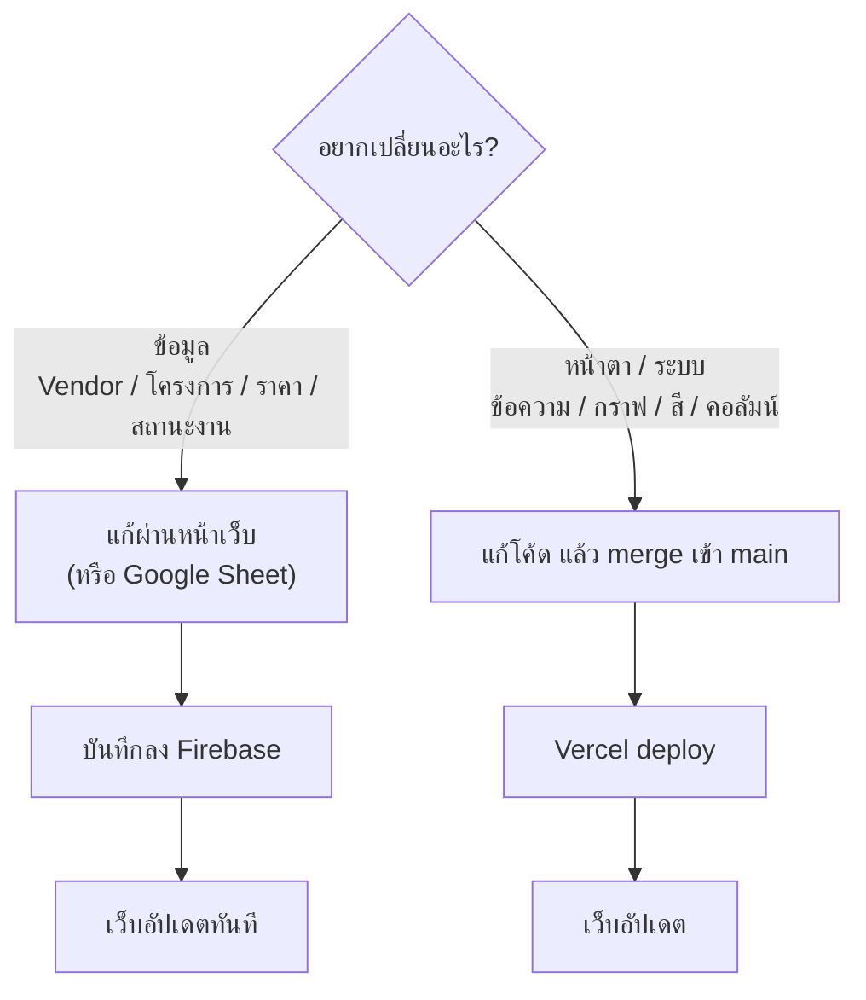

# คู่มือดูแลเว็บไซต์ Gunkul Procurement (สำหรับผู้ที่ไม่เขียนโค้ด)

> คู่มือนี้อธิบายว่าเว็บไซต์ทั้งระบบทำงานอย่างไร ประกอบด้วยอะไรบ้าง
> แต่ละส่วนทำหน้าที่อะไร และทำไมถึงต้องเชื่อมกับ GitHub / Firebase / Vercel /
> Google Sheets — เขียนให้คนที่ไม่มีพื้นฐานเขียนโปรแกรมอ่านเข้าใจได้

**เว็บไซต์จริง:** https://gunkul-procurement.vercel.app
**โค้ด (GitHub):** iqtanakorn19/gunkul-procurement
**ฐานข้อมูล (Firebase):** โปรเจกต์ชื่อ `gunkul-internship`

---

## สารบัญ

1. [ภาพรวม — เว็บนี้คืออะไร](#1-ภาพรวม)
2. [4 ระบบที่เชื่อมกัน และทำไมต้องมีแต่ละอัน](#2-4-ระบบที่เชื่อมกัน)
3. [เว็บอัปเดตขึ้นจริงได้อย่างไร](#3-เว็บอัปเดตขึ้นจริงได้อย่างไร)
4. [หน้าเว็บแต่ละหน้าทำอะไร และข้อมูลมาจากไหน](#4-หน้าเว็บแต่ละหน้า)
5. [ข้อมูลใน Firebase (คลังข้อมูล)](#5-ข้อมูลใน-firebase)
6. [การซิงค์จาก Google Sheet → เว็บ (หน้า Tracking)](#6-การซิงค์-google-sheet)
7. [งานดูแลที่พบบ่อย](#7-งานดูแลที่พบบ่อย)
8. [จุดอันตราย — สิ่งที่ห้ามแตะ](#8-จุดอันตราย)
9. [เมื่อมีปัญหา ทำอย่างไร / ติดต่อใคร](#9-เมื่อมีปัญหา)
10. [อภิธานศัพท์ (คำศัพท์ที่เจอบ่อย)](#10-อภิธานศัพท์)

---

## 1. ภาพรวม

เว็บไซต์นี้เป็น **เว็บภายในของฝ่ายจัดซื้อส่วนกลาง GUNKUL** ใช้สำหรับ:
- ดูข้อมูลภาพรวม (Dashboard, สถานะงาน PR/PA/PO)
- เก็บทะเบียนข้อมูล (ผู้จำหน่าย/Vendor, โครงการ, ราคาสินค้า, พนักงานในฝ่าย)
- เป็นแหล่งอ้างอิงความรู้ (ขั้นตอนงาน, Incoterms, ESG)

**สิ่งสำคัญที่ต้องเข้าใจก่อน:** เว็บไซต์กับข้อมูลเป็น **คนละส่วนกัน**
- **หน้าตาเว็บ + วิธีทำงาน** = อยู่ในโค้ด (เก็บที่ GitHub)
- **ข้อมูลจริง** (Vendor, โครงการ, ราคา ฯลฯ) = อยู่ในฐานข้อมูล (Firebase)

เปรียบเหมือน **ตู้โชว์กับของในตู้** — ตัวตู้ (เว็บ) เปลี่ยนไม่บ่อย แต่ของในตู้ (ข้อมูล)
เปลี่ยนได้ตลอดโดยไม่ต้องแตะตัวตู้ นี่คือเหตุผลว่าทำไมการ "แก้ข้อมูล" (เพิ่ม Vendor,
แก้โครงการ) กับการ "แก้เว็บ" (เปลี่ยนหน้าตา/ข้อความ) ถึงทำคนละที่กัน

---

## 2. 4 ระบบที่เชื่อมกัน

ระบบทั้งหมดประกอบด้วย 4 บริการที่ทำงานร่วมกัน:

### 2.1 GitHub — "พิมพ์เขียวของเว็บ"
เก็บ **โค้ดทั้งหมด** ของเว็บ (หน้าตา, ปุ่ม, การคำนวณกราฟ)
- **ทำไมต้องมี:** เป็นที่เก็บโค้ดแบบมีประวัติ (ย้อนดู/ย้อนกลับได้ว่าใครแก้อะไรเมื่อไหร่)
  และเป็น "ตัวจุดชนวน" ให้เว็บอัปเดต — พอโค้ดใน branch `main` เปลี่ยน เว็บจะอัปเดตเอง
- **เปรียบเทียบ:** เหมือนแบบแปลนบ้าน ถ้าจะเปลี่ยนโครงสร้างบ้านต้องแก้ที่แปลนนี้

### 2.2 Firebase — "คลังข้อมูล + ประตูล็อก + ห้องเก็บไฟล์"
บริการของ Google ที่ทำ 3 อย่างให้เว็บนี้ (โปรเจกต์ชื่อ `gunkul-internship`):
1. **Firestore (ฐานข้อมูล):** เก็บข้อมูลจริงทั้งหมด — Vendor, โครงการ, ราคาสินค้า,
   สถานะงาน, พนักงาน ฯลฯ
2. **Authentication (ล็อกอิน):** ระบบอีเมล/รหัสผ่านที่หน้า Login ใช้ตรวจว่าใครมีสิทธิ์เข้า
3. **Storage (ห้องเก็บไฟล์):** เก็บไฟล์ที่อัปโหลด เช่น เอกสาร Knowledge Base, ESG
- **ทำไมต้องมี:** เว็บเป็นแค่ "เปลือก" ข้อมูลจริงอยู่ที่นี่ และทุกคนเห็นข้อมูลชุดเดียวกัน
  แบบ real-time (ใครแก้ อีกคนเห็นทันที)
- **เปรียบเทียบ:** เหมือนตู้เอกสารกลางของออฟฟิศ ที่ทุกคนหยิบ/ใส่เอกสารร่วมกัน

### 2.3 Vercel — "โรงพิมพ์/ผู้เผยแพร่"
บริการที่เอาโค้ดจาก GitHub มา "ประกอบเป็นเว็บจริง" แล้วเอาขึ้นออนไลน์
- **ทำไมต้องมี:** โค้ดใน GitHub เป็นแค่ไฟล์ ต้องมีคนแปลงให้กลายเป็นเว็บที่เปิดได้จริง
  Vercel ทำหน้าที่นี้ และทำ **อัตโนมัติ** ทุกครั้งที่ `main` เปลี่ยน
- **เปรียบเทียบ:** เหมือนโรงพิมพ์ที่รับต้นฉบับ (โค้ด) มาพิมพ์เป็นหนังสือ (เว็บ) วางขาย

### 2.4 Google Sheets + Apps Script — "ที่กรอกงานของทีม"
เฉพาะข้อมูล **Tracking (PR/PA/PO)** ทีมกรอกใน Google Sheet ที่คุ้นเคย ไม่ได้กรอกในเว็บ
มีสคริปต์เล็กๆ (Apps Script) คอยคัดลอกข้อมูลจากชีทไปใส่ Firebase ให้อัตโนมัติ
- **ทำไมต้องมี:** ทีมถนัดกรอก Excel/Sheet มากกว่ากรอกในเว็บ สคริปต์เลยทำหน้าที่
  "สะพาน" ให้ข้อมูลจากชีทไปโผล่บนเว็บโดยไม่ต้องก๊อปเอง
- **เปรียบเทียบ:** เหมือนมีผู้ช่วยคอยถ่ายสำเนาจากสมุดจดงาน (ชีท) ไปติดบอร์ดกลาง (เว็บ)

---

## 3. เว็บอัปเดตขึ้นจริงได้อย่างไร

เว็บที่คนเห็น = โค้ดใน branch ชื่อ **`main`** เท่านั้น ขั้นตอนการอัปเดตหน้าตา/ระบบเว็บ:

1. ทีมพัฒนาแก้โค้ดในสาขาแยก (branch ของตัวเอง) → เปิด **Pull Request (PR)**
2. รวม PR เข้า `main` (แบบ squash-merge)
3. **Vercel เห็นว่า `main` เปลี่ยน → build ใหม่อัตโนมัติ → เว็บอัปเดตภายในไม่กี่นาที**

> 📌 **จำง่ายๆ:** เว็บ = สิ่งที่อยู่บน `main` เสมอ ถ้าอยากเปลี่ยนหน้าตา/ข้อความ/ระบบ
> ต้องแก้โค้ดแล้ว merge เข้า `main` — จากนั้นเว็บอัปเดตเอง ไม่ต้องกดอะไรที่ Vercel

**สำคัญ:** การ "เปลี่ยนข้อมูล" (เพิ่ม Vendor, แก้โครงการ) **ไม่ต้อง** ผ่านขั้นตอนนี้เลย
เพราะข้อมูลอยู่ที่ Firebase — แก้ผ่านหน้าเว็บได้ทันที เว็บอัปเดตทันที (ดูข้อ 7)

---

## 4. หน้าเว็บแต่ละหน้า

เว็บมี 9 หน้า (เมนูซ้ายมือ) แต่ละหน้าดึงข้อมูลจากที่ต่างกัน และบางหน้าแก้ได้ บางหน้าดูอย่างเดียว

| หน้า | ทำอะไร | ข้อมูลมาจาก | แก้ในเว็บได้ไหม |
|------|--------|-------------|----------------|
| **Home** (หน้าแรก) | อธิบายภาพรวมฝ่าย, ขั้นตอนงาน (Workflow), บริษัทในเครือ, ที่ตั้ง | ข้อความส่วนใหญ่ **ฝังในโค้ด** / รายการโครงการดึงจาก Firebase (`homeProjects`) | รายการโครงการแก้ได้ / ข้อความอื่นต้องแก้โค้ด |
| **Dashboard** | สรุปตัวเลข KPI + กราฟสถานะงาน, ปริมาณงานต่อคน, เวลาแต่ละขั้นตอน | คำนวณจากข้อมูล Tracking (`trackingTabs`) | ❌ ดูอย่างเดียว (คำนวณอัตโนมัติ) |
| **Project** (โครงการ) | ทะเบียนโครงการ + กราฟวิเคราะห์ | Firebase (`kickoffProjects`) | ✅ เพิ่ม/แก้/ลบ + นำเข้า Excel |
| **Item Master** | เปรียบเทียบราคาสินค้าต่อ Vendor | Firebase (`items`) นำเข้าจาก Excel | ✅ นำเข้า Excel |
| **Vendor Directory** | ทะเบียนผู้จำหน่าย + ประวัติการซื้อ | Firebase (`vendors`, `poLines`) นำเข้าจาก Excel | ✅ แก้หมวด/สถานะ/โน้ต + นำเข้า Excel |
| **Tracking Sheet** | กระจกสะท้อนสถานะ PR/PA/PO จาก Google Sheet | Firebase (`trackingTabs`) ที่ซิงค์มาจาก Google Sheet | ❌ ดูอย่างเดียว — **แก้ที่ Google Sheet เท่านั้น** |
| **Knowledge Base** | คลังความรู้ + เอกสารแนบ | Firebase (`knowledgeDocs`) + ไฟล์ใน Storage | ✅ อัปโหลด/จัดการเอกสาร |
| **ESG & Sustainability** | เอกสาร/เทมเพลตด้าน ESG | Firebase (`esgDocs`, `esgTemplates`) + Storage | ✅ อัปโหลด/จัดการเอกสาร |
| **Organization Chart** | ผังองค์กร + ทำเนียบพนักงานฝ่าย | Firebase (`orgChart`, `staffDirectory`) | ✅ แก้ผัง + แก้ตารางพนักงาน |

> 💡 **หน้าที่ "ดูอย่างเดียว" มี 2 หน้า:** Dashboard (คำนวณอัตโนมัติ) และ Tracking Sheet
> (แก้ที่ Google Sheet) — ที่เหลือแก้ผ่านเว็บได้โดยตรง

---

## 5. ข้อมูลใน Firebase

ข้อมูลใน Firestore แบ่งเป็น "กล่อง" (เรียกว่า collection) แต่ละกล่องเก็บข้อมูลคนละชนิด

| กล่อง (collection) | เก็บอะไร | ใช้ที่หน้า |
|--------------------|----------|-----------|
| `homeProjects` | รายการโครงการตัวอย่างบนหน้าแรก | Home |
| `kickoffProjects` | ทะเบียนโครงการหลัก (พร้อมสเปค/งบ/สถานะ) | Project |
| `settings` | ตัวเลือกยี่ห้อที่ผู้ใช้เพิ่มเอง (เช่น PV/Inverter brand) | Project |
| `items` | รายการสินค้า + ราคาต่อ Vendor | Item Master |
| `importHistory` | ประวัติการนำเข้าไฟล์ PO แต่ละครั้ง (ใคร/เมื่อไหร่/ไฟล์อะไร) | Item Master (ปุ่ม "ประวัติการนำเข้า") |
| `vendors` | ทะเบียนผู้จำหน่าย + ยอดซื้อสะสม | Vendor Directory |
| `poLines` | รายการ PO รายบรรทัด (ประวัติการซื้อของ Vendor) | Vendor Directory |
| `trackingTabs` (+ `rows`) | สถานะ PR/PA/PO ซิงค์มาจาก Google Sheet | Tracking, Dashboard |
| `meta` | ข้อมูลเบ็ดเตล็ด เช่น วันที่ซิงค์ล่าสุด, วันอัปเดตต่อบริษัท | Dashboard, Vendor |
| `orgChart` | โครงสร้างผังองค์กร | Organization Chart |
| `staffDirectory` | ทำเนียบพนักงานฝ่าย (ชื่อ, เบอร์, อีเมล) | Organization Chart |
| `knowledgeDocs` | รายการเอกสารความรู้ | Knowledge Base |
| `esgDocs`, `esgTemplates` | เอกสาร/เทมเพลต ESG | ESG |

**สิทธิ์การเข้าถึง (Security Rules):** ทุกกล่องตั้งไว้ว่า "ต้องล็อกอินก่อนถึงอ่าน/เขียนได้"
กฎนี้เก็บไว้ในไฟล์ `firestore.rules` ในโค้ด แต่ **ต้องกด Publish ใน Firebase Console
เองด้วย** เวลาแก้กฎ (โค้ดในไฟล์อย่างเดียวไม่ทำให้กฎมีผล) — ข้อยกเว้นเดียว: **ลบ Vendor ทั้งราย**
ทำได้เฉพาะ admin (ตอนนี้มีแค่ tanawat.han@gunkul.com) คนอื่น login แล้วยังแก้ข้อมูล Vendor
ได้ปกติ แค่ปุ่มลบจะไม่โชว์ให้

---

## 6. การซิงค์ Google Sheet → เว็บ

หน้า **Tracking Sheet** และตัวเลขใน **Dashboard** มาจาก Google Sheet กลาง ผ่านสคริปต์
Apps Script ที่ฝังอยู่ในชีท (ไฟล์ `google-apps-script/Code.gs` ในโค้ดเป็นต้นฉบับ)

**หลักการทำงาน:**
- ชีทมี 1 แท็บต่อ 1 คน (เช่น P'Jame, P'Kae) — แต่ละแท็บ = 1 คนในเว็บ
- พอมีคนแก้เซลล์ → สคริปต์ส่งข้อมูลแถวนั้นขึ้น Firebase ภายในไม่กี่วินาที
- มีการซิงค์สำรองทุก 6 ชั่วโมง (กันข้อมูลตกหล่น + ลบแถวที่ถูกลบในชีท)
- ป้าย "ซิงค์ล่าสุด" บน Dashboard/Tracking บอกว่าข้อมูลอัปเดตล่าสุดเมื่อไหร่

> ⚠️ **ข้อควรระวังเรื่องคอลัมน์ในชีท:** สคริปต์อ่านข้อมูล **ตามตำแหน่งคอลัมน์**
> (ไม่ใช่ตามชื่อหัวคอลัมน์) ดังนั้น **ห้ามย้าย/ลบ/แทรกคอลัมน์ หรือเปลี่ยนลำดับหัวตาราง**
> ในช่วง 30 คอลัมน์แรก (A–AD) เพราะจะทำให้ข้อมูลเพี้ยน — ถ้าจะเพิ่มคอลัมน์ ให้เพิ่ม
> ต่อท้ายสุด (หลังคอลัมน์ที่ระบบซ่อนไว้) เท่านั้น การ **ซ่อน/กรอง/เรียงแถว** ทำได้ปลอดภัย

**สำคัญมาก:** ไฟล์ `Code.gs` ในโค้ด GitHub เป็นแค่ **ต้นฉบับสำรอง** การแก้ไฟล์นี้
ใน GitHub **ไม่ได้** ทำให้สคริปต์ในชีทเปลี่ยน — ต้องเข้าไปวางโค้ดใหม่ในชีท
(Extensions → Apps Script) เองทุกครั้ง (ดูขั้นตอนเต็มใน `google-apps-script/SETUP.md`)

---

## 7. งานดูแลที่พบบ่อย

ก่อนลงมือ ให้ถามตัวเองก่อนว่า "จะเปลี่ยนอะไร" — คำตอบจะบอกว่าต้องทำที่ไหน:

### 7.1 แก้ "ข้อมูล" (ไม่ต้องยุ่งกับโค้ด)
งานพวกนี้ทำผ่านหน้าเว็บได้เลย เว็บอัปเดตทันที:

| อยากทำ | ทำที่ไหน |
|--------|----------|
| เพิ่ม/แก้/ลบ โครงการ | หน้า **Project** → ปุ่มเพิ่มโครงการ / ไอคอนดินสอ-ถังขยะ |
| นำเข้าราคาสินค้า / Vendor / PO | หน้า **Item Master** / **Vendor Directory** → ปุ่มนำเข้าข้อมูล (อัปโหลดไฟล์ Excel) |
| แก้หมวด/สถานะ/โน้ต ของ Vendor | หน้า **Vendor Directory** → คลิกที่การ์ด Vendor |
| แก้ผังองค์กร / ทำเนียบพนักงาน | หน้า **Organization Chart** → คลิกแก้ในช่องได้เลย |
| อัปโหลดเอกสารความรู้ / ESG | หน้า **Knowledge Base** / **ESG** → ปุ่มอัปโหลด |
| แก้สถานะงาน PR/PA/PO | **Google Sheet กลาง** (ไม่ใช่ในเว็บ) |
| ส่งออกข้อมูลเป็น Excel | ปุ่ม "Export Excel" ในหน้า Project / Vendor / Tracking / ทำเนียบพนักงาน |

### 7.2 แก้ "เว็บ" (ต้องแก้โค้ด — ต้องมีคนที่เขียนโค้ดได้)
งานพวกนี้ต้องแก้โค้ดแล้ว merge เข้า `main`:
- เปลี่ยนข้อความ/หัวข้อบนหน้าแรก (Home)
- เพิ่ม/ลบคอลัมน์ในตาราง, เพิ่มกราฟใหม่, เปลี่ยนสี/หน้าตา
- เพิ่มบริษัทในตาราง "บริษัทในเครือ" (แก้ในไฟล์ `src/HomePage.tsx`)

> ถ้ายังไม่มีทีมพัฒนาประจำ: งานกลุ่มนี้ให้รวบรวมไว้แล้วหาคนที่เขียน React/TypeScript
> ได้มาช่วยเป็นครั้งคราว — ระบุให้ชัดว่าอยากได้อะไร แล้วเขาแก้ + merge เข้า main ให้

---

## 8. จุดอันตราย

สิ่งที่ **ห้ามทำ** เพราะอาจทำให้ระบบพัง:

| ❌ ห้าม | เพราะ |
|---------|-------|
| ย้าย/ลบ/แทรกคอลัมน์ 30 ช่องแรกใน Google Sheet | สคริปต์อ่านตามตำแหน่ง → ข้อมูลเพี้ยนทั้งระบบ |
| ลบ collection ใน Firebase | ข้อมูลหายถาวร (Vendor/โครงการ/ทั้งหมด) |
| แก้ไฟล์โค้ดตรงๆ บน `main` โดยไม่ทดสอบ | เว็บพังทันทีเพราะ `main` = เว็บจริง |
| เปลี่ยนค่า config ใน `src/firebase.ts` | เว็บจะเชื่อมฐานข้อมูลไม่ได้ |
| ปิด/ลบโปรเจกต์ Firebase `gunkul-internship` | ข้อมูล + ล็อกอินหายทั้งหมด |
| ลบ/แก้บัญชี Vercel หรือ GitHub repo | เว็บหาย / อัปเดตไม่ได้ |

**ก่อนแก้อะไรที่ไม่แน่ใจ** — ถามคนที่เข้าใจระบบก่อนเสมอ ข้อมูลบางอย่างกู้คืนไม่ได้

---

## 9. เมื่อมีปัญหา

| อาการ | สาเหตุที่เป็นไปได้ / วิธีเช็ค |
|-------|------------------------------|
| หน้าเว็บว่างเปล่า ไม่มีข้อมูล | อาจล็อกอินไม่สำเร็จ หรือ Firebase มีปัญหา — ลองล็อกอินใหม่ |
| แก้ Google Sheet แล้วเว็บไม่เปลี่ยน | รอ 2–3 นาที / เช็คป้าย "ซิงค์ล่าสุด" / อาจต้องรันสคริปต์ในชีทใหม่ |
| นำเข้า Excel ไม่ได้ | เช็คว่าหัวคอลัมน์ในไฟล์ตรงกับที่ระบบต้องการ |
| บันทึกข้อมูลในเว็บไม่ได้ | เช็คว่า Security Rules ใน Firebase อนุญาต (กด Publish แล้วหรือยัง) |
| หน้าตาเว็บเพี้ยน หลัง merge โค้ด | ย้อนโค้ดกลับ (revert) ที่ GitHub — เว็บจะกลับสภาพเดิมอัตโนมัติ |

**บัญชี/บริการที่ต้องรู้ว่าใครถือ:**
- GitHub repo `iqtanakorn19/gunkul-procurement` — ใครเป็นเจ้าของ/มีสิทธิ์ push
- Firebase โปรเจกต์ `gunkul-internship` — ใครเข้า Console ได้
- Vercel — ใครเป็นเจ้าของบัญชีที่เชื่อมกับ repo นี้
- Google Sheet กลาง + Apps Script — ใครเป็นเจ้าของชีท

> 📝 แนะนำ: จดชื่อผู้ถือบัญชีทั้ง 4 อย่างข้างบนไว้ในที่ปลอดภัย เพราะถ้าคนเดิมออก
> จะต้องโอนสิทธิ์เหล่านี้ต่อ ไม่งั้นจะแก้ไข/ดูแลระบบต่อไม่ได้

---

## 10. อภิธานศัพท์

| คำ | ความหมายง่ายๆ |
|----|----------------|
| **Repository (repo)** | ที่เก็บโค้ดทั้งโปรเจกต์บน GitHub |
| **Branch / `main`** | สาขาของโค้ด — `main` คือสาขาที่ตรงกับเว็บจริง |
| **Pull Request (PR)** | คำขอรวมโค้ดที่แก้แล้วเข้า `main` (มีการรีวิวก่อน) |
| **Merge** | การรวมโค้ดเข้าด้วยกัน |
| **Deploy** | การเอาโค้ดขึ้นเป็นเว็บจริง (Vercel ทำอัตโนมัติ) |
| **Firestore** | ฐานข้อมูลของ Firebase (เก็บข้อมูลเป็น collection) |
| **Collection** | "กล่อง" เก็บข้อมูลชนิดเดียวกันใน Firestore |
| **Authentication** | ระบบตรวจสอบล็อกอิน (อีเมล/รหัสผ่าน) |
| **Storage** | ที่เก็บไฟล์อัปโหลดใน Firebase |
| **Security Rules** | กฎว่าใครอ่าน/เขียนข้อมูลได้ |
| **Apps Script** | สคริปต์เล็กๆ ที่รันในตัว Google Sheet |
| **Import / Export** | นำเข้า / ส่งออกข้อมูล (มักเป็นไฟล์ Excel) |

---

*คู่มือนี้อยู่ในโค้ดที่ `docs/HANDBOOK.md` — ถ้าระบบมีการเปลี่ยนแปลง ควรอัปเดตคู่มือนี้ด้วย*
