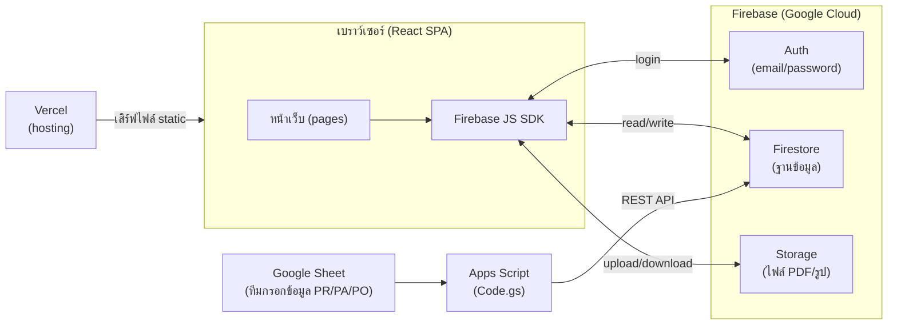
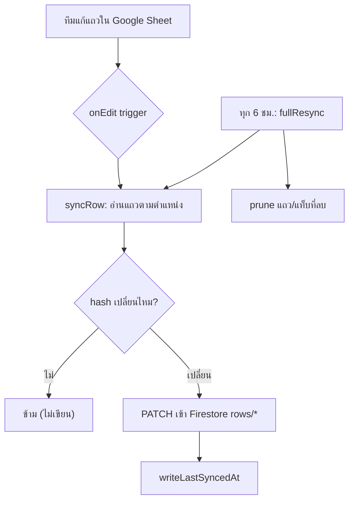
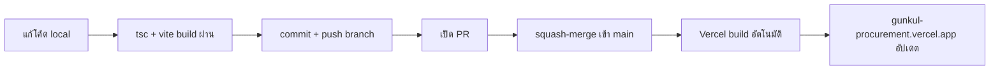

# คู่มือทางเทคนิค (Technical Handbook) — gunkul-procurement

> เอกสารนี้เขียนสำหรับ **นักพัฒนา (developer)** ที่จะมารับช่วงดูแล/ต่อยอดระบบ
> ถ้าคุณเป็นสายไม่เขียนโค้ด ให้อ่าน `docs/HANDBOOK.md` ก่อน (อธิบายภาพรวมแบบไม่เทคนิค)
> เอกสารนี้ลงลึกถึงระดับ **ฟังก์ชัน / API / โครงสร้างข้อมูล** พร้อมอธิบายว่าแต่ละอย่าง
> **ทำอะไร (What) / ทำไมต้องมี (Why) / ทำงานยังไง (How)**
>
> อ้างอิงไฟล์จริงในโค้ด ณ วันที่เขียน — ถ้าโค้ดเปลี่ยน ให้อัปเดตเอกสารนี้ด้วย

---

## สารบัญ

1. [ภาพรวมสถาปัตยกรรม](#1-ภาพรวมสถาปัตยกรรม)
2. [ภาษาและเทคโนโลยีที่ใช้ (พร้อมเหตุผล)](#2-ภาษาและเทคโนโลยีที่ใช้-พร้อมเหตุผล)
3. [โครงสร้างโฟลเดอร์](#3-โครงสร้างโฟลเดอร์)
4. [การตั้งค่า build / tooling](#4-การตั้งค่า-build--tooling)
5. [Firebase: ต่อ API ยังไง](#5-firebase-ต่อ-api-ยังไง)
6. [โครงสร้างข้อมูลใน Firestore (ทุก collection)](#6-โครงสร้างข้อมูลใน-firestore-ทุก-collection)
7. [Data layer: `data/procurement.ts` ทุกฟังก์ชัน](#7-data-layer-dataprocurementts-ทุกฟังก์ชัน)
8. [Frontend: routing, auth, การ keep-mounted](#8-frontend-routing-auth-การ-keep-mounted)
9. [แต่ละหน้า (page) ทำอะไร อ่านข้อมูลจากไหน](#9-แต่ละหน้า-page-ทำอะไร-อ่านข้อมูลจากไหน)
10. [Component ที่ใช้ซ้ำ (PageKit ฯลฯ)](#10-component-ที่ใช้ซ้ำ-pagekit-ฯลฯ)
11. [ระบบ theme (light/dark) และ design tokens](#11-ระบบ-theme-lightdark-และ-design-tokens)
12. [Google Apps Script sync (Sheet → Firestore)](#12-google-apps-script-sync-sheet--firestore)
13. [การจัดการระบบ (System Management)](#13-การจัดการระบบ-system-management)
14. [gunkul-warehouse (โปรเจกต์พี่น้อง)](#14-gunkul-warehouse-โปรเจกต์พี่น้อง)
15. [งานที่ทำบ่อย (Recipes)](#15-งานที่ทำบ่อย-recipes)
16. [ข้อควรระวัง / หนี้ทางเทคนิค](#16-ข้อควรระวัง--หนี้ทางเทคนิค)

---

## 1. ภาพรวมสถาปัตยกรรม

แอปนี้เป็น **Single Page Application (SPA)** ล้วนๆ ไม่มี backend server ที่เราเขียนเอง —
"backend" ทั้งหมดคือบริการของ Google (Firebase) ที่ client เรียกตรง



**หลักสำคัญที่ต้องเข้าใจ:**
- ไม่มี API server กลาง — **ทุกหน้าคุยกับ Firestore โดยตรง** ผ่าน Firebase SDK
- ความปลอดภัยไม่ได้อยู่ที่ "ซ่อน API key" แต่อยู่ที่ **Firestore Security Rules** (ดูข้อ 5)
- ข้อมูล PR/PA/PO ทีมกรอกใน **Google Sheet** → Apps Script ดันเข้า Firestore → เว็บอ่านมาโชว์ (read-only mirror)
- ข้อมูล vendor/item มาจากการ **import ไฟล์ Excel** ที่ export จากระบบ D365
- deploy โดย push เข้า `main` → Vercel build+deploy อัตโนมัติ

---

## 2. ภาษาและเทคโนโลยีที่ใช้ (พร้อมเหตุผล)

| เทคโนโลยี | เวอร์ชัน | ใช้ทำอะไร (What) | ทำไมเลือกอันนี้ (Why) |
|---|---|---|---|
| **TypeScript** | ~6.0 | ภาษาหลักทั้งโปรเจกต์ (`.ts`/`.tsx`) | JavaScript + ระบบ type ช่วยจับ bug ตั้งแต่ตอนเขียน ก่อน runtime |
| **React** | 19.2 | สร้าง UI แบบ component | มาตรฐานอุตสาหกรรม, ecosystem ใหญ่, ทีมส่วนใหญ่คุ้นเคย |
| **Vite** | 8.0 | dev server + bundler (แปลงโค้ดเป็นไฟล์ที่ browser รันได้) | เร็วมาก (esbuild), config น้อย, hot-reload ทันใจ |
| **Firebase** | 12.14 | Auth + Firestore + Storage | ไม่ต้องเขียน backend เอง, real-time sync, free tier พอสำหรับทีมภายใน |
| **recharts** | 3.8 | กราฟทุกอันในเว็บ | เป็น React component ล้วน เขียนกราฟเหมือนเขียน JSX |
| **xlsx (SheetJS)** | 0.18 | อ่าน/เขียนไฟล์ Excel | ทีมทำงานด้วย Excel เป็นหลัก ต้อง import/export ได้ |
| **@tabler/icons-react** | 3.44 | ไอคอน (เป็น React component) | ครบ, เส้นสวย, ใช้เป็น JSX ได้เลย |
| **ESLint** | 10.4 | ตรวจคุณภาพโค้ด (lint) | จับ pattern ผิดๆ, บังคับ rules-of-hooks |

**ภาษาที่ใช้เขียนแยกตามส่วน:**
- **เว็บแอป** → TypeScript + JSX (React)
- **สไตล์** → ไม่มี CSS framework (ไม่มี Tailwind/Bootstrap) ใช้ **inline style** + **CSS custom properties** (design tokens ใน `tokens.css`)
- **ตัว sync ข้อมูล** → **Google Apps Script** (เป็น JavaScript รันบน Google ไม่ใช่บน Vercel — ดูข้อ 12)

> **Why ไม่ใช้ CSS framework?** ทีมอยากได้ลุค editorial เฉพาะตัว (navy + gold, serif headings)
> การคุม inline style + tokens ให้ควบคุมดีไซน์ได้ละเอียดกว่า และ bundle เล็กกว่าการลาก framework มาทั้งตัว

---

## 3. โครงสร้างโฟลเดอร์

```
gunkul-procurement/
├── src/
│   ├── main.tsx            # จุดเริ่ม: mount <App> ลง #root, ครอบด้วย ThemeProvider
│   ├── App.tsx             # shell: auth gate + sidebar + router (state-based)
│   ├── firebase.ts         # init Firebase, export auth/db/storage
│   ├── Sidebar.tsx         # เมนูซ้าย + นิยาม type Page
│   ├── ThemeContext.tsx    # context เก็บ theme light/dark
│   ├── ThemeToggle.tsx     # ปุ่มสลับ theme
│   │
│   ├── LoginPage.tsx       # หน้า login (บังคับ @gunkul.com)
│   ├── HomePage.tsx        # หน้าแรก (landing, ข้อมูลบริษัท, project farm)
│   ├── Dashboard.tsx       # dashboard (wrapper บางๆ ครอบ TrackingOverview)
│   ├── TrackingOverview.tsx# กราฟวิเคราะห์ทั้งหมด (KPI, cycle-time, workload)
│   ├── TrackingPage.tsx    # ตาราง PR/PA/PO (read-only mirror ของ Sheet)
│   ├── ProjectPage.tsx     # ทะเบียนโครงการ solar + กราฟ ~10 อัน
│   ├── ItemMasterPage.tsx  # เทียบราคาสินค้าข้าม vendor
│   ├── VendorPage.tsx      # directory ผู้ขาย
│   ├── KnowledgePage.tsx   # คลังความรู้ + เอกสาร PDF
│   ├── ESGPage.tsx         # หน้า ESG/ความยั่งยืน
│   ├── OrgChartPage.tsx    # ผังองค์กร (แก้ไขได้) + StaffDirectory
│   │
│   ├── components/
│   │   ├── PageKit.tsx      # UI primitives ใช้ซ้ำ (Reveal, Section, HoverCard...)
│   │   ├── ImportModal.tsx  # modal อัปโหลด Excel
│   │   ├── CompanyUpdates.tsx # panel วันที่ update ล่าสุดต่อบริษัท
│   │   ├── SyncStatus.tsx   # pill "synced X ago"
│   │   ├── StaffDirectory.tsx # ตารางรายชื่อพนักงาน (แก้ไขได้)
│   │   └── FileVault.tsx    # คลังไฟล์ generic (ใช้ใน ESG)
│   │
│   ├── data/
│   │   ├── procurement.ts   # ★ logic parse Excel + import เข้า Firestore
│   │   └── projectSeed.ts   # ข้อมูลตั้งต้นโครงการ solar (static)
│   │
│   └── styles/
│       ├── tokens.css       # ★ design system: สี, spacing, radius, font
│       └── orgchart.css     # สไตล์เฉพาะผังองค์กร
│
├── google-apps-script/      # ตัว sync Sheet→Firestore (รันบน Google ไม่ใช่ Vercel)
│   ├── Code.gs
│   ├── SETUP.md
│   └── appsscript.json
│
├── docs/                    # เอกสาร (HANDBOOK.md, TECHNICAL.md, kickoff)
├── public/                  # ไฟล์ static (โลโก้, รูปพื้นหลัง, PDF, favicon)
├── firestore.rules          # กฎความปลอดภัย Firestore (ต้อง publish เองใน Console)
├── package.json             # dependencies + scripts
├── vite.config.ts           # config Vite
└── tsconfig*.json           # config TypeScript
```

**หลักการจัดวาง:** page อยู่ที่ราก `src/` (1 ไฟล์ = 1 หน้า), UI ที่ใช้ซ้ำอยู่ใน `components/`,
logic ข้อมูลอยู่ใน `data/`, design tokens อยู่ใน `styles/`

---

## 4. การตั้งค่า build / tooling

### คำสั่งใน `package.json`

```jsonc
"dev":     "vite",              // รัน dev server ที่ localhost (hot-reload)
"build":   "tsc -b && vite build", // type-check ก่อน แล้วค่อย build จริง
"lint":    "eslint .",          // ตรวจคุณภาพโค้ด
"preview": "vite preview"       // preview ผล build ในเครื่อง
```

**ก่อน commit ทุกครั้ง** (ตาม CLAUDE.md):
```bash
rm -f tsconfig.tsbuildinfo && npx tsc --noEmit && npm run build
```
> **Why ต้องลบ `tsconfig.tsbuildinfo`?** มันเป็น cache ของ TypeScript ที่บางทีเก็บผลเก่าไว้
> ทำให้ error จริงถูกซ่อน — ลบทิ้งก่อนเพื่อ type-check ใหม่หมดจริงๆ

### TypeScript
ใช้ **project references**: `tsconfig.json` (ราก) อ้างถึง 2 ไฟล์
- `tsconfig.app.json` → โค้ดใน`src/` (target ES2023, `jsx: react-jsx`, `moduleResolution: bundler`, `noEmit`)
- `tsconfig.node.json` → `vite.config.ts` (env แบบ node)

มี flag เข้ม: `noUnusedLocals`, `noUnusedParameters`, `noFallthroughCasesInSwitch`
> หมายเหตุ: **ไม่ได้เปิด `strict: true`** ตรงๆ (เปิดเฉพาะบาง flag) — ถ้าจะเพิ่มความเข้มในอนาคต แก้ตรงนี้

### Vite
`vite.config.ts` เรียบง่ายมาก มีแค่ plugin เดียว:
```ts
export default defineConfig({ plugins: [react()] })
```

### สิ่งที่ **ไม่มี** ในโปรเจกต์ (ต้องรู้)
- **ไม่มี test runner** (ไม่มี Vitest/Jest/Playwright ติดตั้งใน `package.json`)
- **ไม่มี CI/CD ใน repo** (ไม่มี `.github/workflows`) — deploy พึ่ง Vercel ล้วน
- **ไม่มี `vercel.json`/`firebase.json`** — ตั้งค่า deploy อยู่ในหน้าเว็บ Vercel/Firebase Console
- **ไม่มี `.env`** — config Firebase hardcode ใน `firebase.ts` (เป็น public key โดยดีไซน์)

---

## 5. Firebase: ต่อ API ยังไง

### การ init — `src/firebase.ts`

```ts
import { initializeApp, getApps, getApp } from "firebase/app";
import { getAuth } from "firebase/auth";
import { getFirestore } from "firebase/firestore";
import { getStorage } from "firebase/storage";

const firebaseConfig = {
  apiKey: "AIza...",
  authDomain: "gunkul-internship.firebaseapp.com",
  projectId: "gunkul-internship",
  storageBucket: "gunkul-internship.firebasestorage.app",
  // ...
};

// สร้าง app ครั้งเดียว (กันการ init ซ้ำตอน hot-reload)
const app = getApps().length === 0 ? initializeApp(firebaseConfig) : getApp();

export const auth = getAuth(app);     // ใช้ login
export const db = getFirestore(app);  // ใช้อ่าน/เขียนฐานข้อมูล
export const storage = getStorage(app); // ใช้ upload ไฟล์
```

- **What:** ไฟล์เดียวที่ทั้งแอปดึง `auth`, `db`, `storage` ไปใช้
- **Why singleton:** ป้องกัน init ซ้ำเวลา Vite hot-reload (จะ error ถ้ามี app ซ้ำ)
- **Why hardcode key ได้:** `apiKey` ของ Firebase web **เป็น public โดยดีไซน์** — มันแค่บอกว่า project ไหน
  ไม่ใช่รหัสลับ ความปลอดภัยจริงอยู่ที่ Security Rules

### วิธีเรียก 3 API หลัก

**1) Auth (login/signup)** — ใช้ใน `LoginPage.tsx`
```ts
import { signInWithEmailAndPassword } from "firebase/auth";
await signInWithEmailAndPassword(auth, email, password);
// signup ใช้ createUserWithEmailAndPassword (บังคับโดเมน @gunkul.com เอง)
```
สถานะ login เช็คใน `App.tsx` ผ่าน `onAuthStateChanged(auth, cb)`

**2) Firestore (อ่าน/เขียนข้อมูล)** — pattern ที่ใช้ทั้งแอป
```ts
import { collection, onSnapshot, doc, setDoc, updateDoc, deleteDoc, addDoc } from "firebase/firestore";

// อ่านแบบ real-time (subscribe): ข้อมูลเปลี่ยน → UI อัปเดตเอง
const unsub = onSnapshot(collection(db, "vendors"), (snap) => {
  const rows = snap.docs.map(d => ({ id: d.id, ...d.data() }));
  setVendors(rows);
});
// อย่าลืม unsub() ตอน component unmount

// เขียน
await setDoc(doc(db, "vendors", id), data, { merge: true }); // เขียนทับ/รวม
await updateDoc(doc(db, "vendors", id), { status: "active" }); // แก้บาง field
await addDoc(collection(db, "homeProjects"), data);            // สร้าง doc id อัตโนมัติ
await deleteDoc(doc(db, "vendors", id));                       // ลบ
```
> **Why `onSnapshot` ไม่ใช่ `getDocs`?** `onSnapshot` = real-time subscribe (ข้อมูลใน DB เปลี่ยน
> หน้าเว็บอัปเดตทันทีไม่ต้อง refresh) เหมาะกับ dashboard ที่หลายคนดูพร้อมกัน
> `getDocs` = อ่านครั้งเดียว ใช้ตอนต้องการ snapshot ชั่วคราว (เช่น cross-tab search)

**3) Storage (อัปโหลดไฟล์)** — ใช้ใน KnowledgePage, FileVault
```ts
import { ref, uploadBytes, getDownloadURL } from "firebase/storage";
const r = ref(storage, `knowledgeDocs/${id}-${file.name}`);
await uploadBytes(r, file);
const url = await getDownloadURL(r); // เก็บ url นี้ไว้ใน Firestore doc
```

### Security Rules — `firestore.rules` (ระบบปิด)

ทุก collection ใช้ `isMember()` = อีเมลที่**ยืนยันแล้ว** และอยู่ใน `allowedUsers/{email}` (หรือเป็น bootstrap admin)
- `allowedUsers`: ทุกคนอ่านได้เฉพาะเอกสารของตัวเอง, แสดงรายการ/เพิ่ม/แก้/ลบได้เฉพาะ admin
- `vendors`: ลบได้เฉพาะ admin (`isAdmin()` = bootstrap admin หรือ role `admin` ในรายชื่อ)
- รายละเอียด การจัดการผู้ใช้ และ**ลำดับการเปิดใช้ที่ปลอดภัย** ดู [`docs/SECURITY.md`](SECURITY.md)
- **⚠️ How to deploy:** ไฟล์นี้ **ไม่ auto-deploy** — ต้องเข้า Firebase Console → Firestore → Rules
  → paste → **Publish** เอง ทุกครั้งที่เพิ่ม collection ใหม่ ต้องเพิ่ม match block (ใช้ `isMember()`) ที่นี่ด้วย

---

## 6. โครงสร้างข้อมูลใน Firestore (ทุก collection)

| Path | เก็บอะไร | อ่านโดย | เขียนโดย |
|---|---|---|---|
| `poLines/{poNo__seq}` | **แหล่งข้อมูลจริง (source of truth)** ของ PO ทุกบรรทัด | procurement.ts, ItemMaster, Vendor drill-down | import Excel (procurement.ts) |
| `vendors/{code}` | สรุปผู้ขาย (cache คำนวณจาก poLines) | VendorPage | import + แก้มือใน VendorPage |
| `items/{itemNumber}` | สรุปสินค้า + สถิติราคาต่อ vendor (cache) | ItemMasterPage | import (procurement.ts) |
| `meta/poImport` | index เก็บเลข PO ที่ import แล้วทั้งหมด | procurement.ts (กัน import ซ้ำ) | import |
| `meta/companyUpdates` | วันที่ update ล่าสุดต่อบริษัท | CompanyUpdates | import |
| `importHistory/{id}` | log การ import แต่ละครั้ง (วันเวลา/ใคร/ไฟล์/จำนวน PO ใหม่) — เขียนทุกครั้งแม้ 0 PO ใหม่ | Item Master → "ประวัติการนำเข้า" | import (procurement.ts) |
| `meta/trackingSync` | เวลา sync Sheet ล่าสุด (`lastSyncedAt`) | SyncStatus | **Apps Script** (REST) |
| `trackingTabs/{tabId}` | 1 doc = 1 แท็บ (1 คน) ในชีต | Dashboard, TrackingPage | **Apps Script** |
| `trackingTabs/{tabId}/rows/{rowId}` | แถว PR/PA/PO แต่ละบรรทัด | TrackingPage, TrackingOverview | **Apps Script** |
| `homeProjects/{id}` | โครงการโชว์หน้า Home | HomePage | HomePage (seed ถ้าว่าง) |
| `kickoffProjects/{id}` | ทะเบียนโครงการ solar | ProjectPage | ProjectPage (seed ถ้าว่าง) |
| `settings/brandOptions` | ตัวเลือกแบรนด์ที่ผู้ใช้เพิ่มเอง | ProjectPage | ProjectPage (`arrayUnion`) |
| `orgChart/main` | ผังองค์กรทั้งต้นไม้ (1 doc) | OrgChartPage | OrgChartPage |
| `staffDirectory/{id}` | 1 doc = พนักงาน 1 คน | StaffDirectory | StaffDirectory |
| `knowledgeDocs/{id}` | เอกสาร PDF (url ชี้ไป Storage) | KnowledgePage | KnowledgePage |
| `esgDocs/`, `esgTemplates/` | คลังไฟล์ ESG | FileVault | FileVault |

**Pattern ที่เจอซ้ำ — "seed-if-empty":**
หลาย collection (homeProjects, kickoffProjects, knowledgeDocs, staffDirectory, orgChart)
พอ `onSnapshot` เห็นว่า collection ว่างครั้งแรก จะเขียนข้อมูลตั้งต้น (seed) ลงไปอัตโนมัติ
> **Why:** ให้ deploy ใหม่/ล้างฐานข้อมูลแล้วยังมีข้อมูลตัวอย่างโชว์ ไม่หน้าจอโล่ง

**⚠️ ข้อควรระวังเรื่อง `trackingTabs`:** doc พวกนี้ **Apps Script เป็นคนเขียน** ผ่าน REST API
(ไม่ใช่เว็บ) เว็บอ่านอย่างเดียว — อย่าเพิ่ม UI แก้ไขในหน้า Tracking เพราะจะโดน sync ทับ

---

## 7. Data layer: `data/procurement.ts` ทุกฟังก์ชัน

ไฟล์นี้คือ **หัวใจของการ import ข้อมูล** ราคา/vendor/item จากไฟล์ Excel (export จาก D365)
เข้า Firestore หลักการดีไซน์ (จาก docstring ต้นไฟล์):

> `poLines` คือ **source of truth เดียว** — `vendors`/`items` เป็นแค่ cache ที่คำนวณใหม่จาก
> `poLines` ทุกครั้งที่ import (จึงไม่มีทางเพี้ยนจากกัน) การ import ซ้ำ **merge ตามเลข PO** —
> PO ที่มีในระบบแล้วจะไม่ถูกแตะอีก (เพราะ D365 export ย้อนได้แค่ ~2 ปี ข้อมูลเก่าต้องเก็บไว้)

### กลุ่มฟังก์ชันทำความสะอาดข้อมูล (cleaning)
| ฟังก์ชัน | What / How |
|---|---|
| `clean(v)` | trim + ยุบ whitespace ซ้ำเป็นช่องว่างเดียว; null → `""` |
| `num(v)` | ตัด comma แล้วแปลงเป็นเลข; แปลงไม่ได้ → `0` |
| `toISODate(v)` | แปลง `Date` / Excel serial / string → `"YYYY-MM-DD"` (Excel serial ใช้ epoch 1899-12-30) |
| `countsAsSpend(status)` | `true` ทุกสถานะ **ยกเว้น** Canceled/Cancelled (ใช้กันไม่ให้ PO ยกเลิกไปปนยอดใช้จ่าย) |

### การ map header → field
```ts
const PO_HEADERS = {
  "purchase order": "poNumber",
  "accounting date": "poDate",
  "vendor account": "vendorCode",
  "amount (thb)": "amountTHB",
  // ... ฯลฯ
};
function normalizeHeader(h) { return clean(h).toLowerCase(); }
```
- **Why map ตามชื่อ header ไม่ใช่ตำแหน่ง:** ไฟล์ Excel ที่ export มา **ลำดับคอลัมน์อาจสลับ**
  ได้ ตราบใดที่ชื่อหัวคอลัมน์ตรง (หลัง normalize = lowercase + trim) ก็ map ถูก
  > ต่างจาก Google Sheet sync (ข้อ 12) ที่อ่าน**ตามตำแหน่ง** — จำความต่างนี้ให้ดี

### `parsePurchaseOrders(buf, startDate)` — อ่าน Excel
- **What:** อ่านไฟล์ Excel (ArrayBuffer) → คืน `{ lines, poNumbers, skippedNoPO, skippedBeforeDate }`
- **How:** `XLSX.read(buf, {cellDates:true})` → อ่าน **sheet แรกเท่านั้น** → แต่ละแถว map ผ่าน
  `PO_HEADERS` → ข้ามแถวที่ไม่มีเลข PO หรือไม่มี vendor code → ข้ามแถวที่ `poDate < startDate`
  (เทียบ string ISO ได้ตรงๆ) → uppercase ชื่อบริษัท

### ฟังก์ชัน aggregate (pure — ไม่แตะ DB)
- `aggregateVendors(lines)` — จับกลุ่มตาม vendorCode (ข้ามรายการ Canceled) คำนวณ totalSpend,
  จำนวน PO, วันซื้อล่าสุด, spend ต่อ category, spend ต่อเดือน (key = `YYYY-MM`)
- `aggregateItems(lines, productMap?)` — เฉพาะรายการที่มี itemNumber, ไม่ Canceled, และ
  **สกุล THB เท่านั้น** (เทียบราคา apples-to-apples) → คำนวณราคา last/avg/min/max ต่อ vendor
  แล้ว **เรียง vendor ถูกสุดขึ้นก่อน**

### กลุ่ม Firestore I/O
| ฟังก์ชัน | What |
|---|---|
| `chunkedSet(entries, merge)` | เขียนเป็น batch ทีละ **400 doc** (ลิมิต Firestore = 500) |
| `chunkedDelete(refs)` | ลบเป็น batch เหมือนกัน |
| `sameSubset(prev, next)` | เช็คว่า doc เปลี่ยนไหม — ถ้าไม่เปลี่ยน **ไม่เขียนซ้ำ** (ประหยัด quota + เก็บ field ที่แก้มือไว้) |
| `loadImportedPOs()` | อ่าน `meta/poImport.poNumbers` → Set (ไว้กัน import ซ้ำ) |
| `loadAllPOLines()` | อ่าน `poLines` ทั้งหมด |

### ★ `importPurchaseOrders(files[], startDate, productMap?)` — เส้นทางเขียนหลัก
รับ **หลายไฟล์ในครั้งเดียว** (`files: {buf, name}[]`) เพราะขั้น 5 ต้องอ่าน `poLines` ทั้งหมด (หลักหมื่นบรรทัด)
ถ้านำเข้าทีละไฟล์จะอ่านซ้ำทุกไฟล์ กินโควตา Firestore ฟรี (50K อ่าน/วัน) — รวมไฟล์เดียวจบ อ่านครั้งเดียว
(เลข PO ที่ซ้ำข้ามไฟล์เก็บครั้งเดียวจากไฟล์แรก ดู `mergeParsed`)

ลำดับการทำงาน:
1. parse ทุกไฟล์ + รวม (`mergeParsed`) + โหลดเลข PO ที่มีแล้ว
2. **merge ตามเลข PO** — เก็บเฉพาะบรรทัดที่ PO ยังไม่เคย import → สร้าง id = `${poNumber}__${seq}`
3. `chunkedSet` เขียน `poLines` ใหม่
4. อัปเดต `meta/poImport` (รวมเลข PO เดิม + ใหม่)
5. **คำนวณ cache ใหม่หมด** จาก poLines ทั้งชุด → `aggregateVendors` + `aggregateItems`
6. upsert `vendors` (merge:true เพื่อ**เก็บ field ที่แก้มือ** เช่น note/status/categories ไว้)
7. upsert `items` + ลบ item ที่ไม่มีใน PO แล้ว
8. **stamp `meta/companyUpdates`** = วันนี้ ต่อทุกบริษัทในไฟล์ (แม้ import แล้วได้ 0 PO ใหม่
   ก็ยัง refresh วันที่ → ให้ UI "อัปเดตล่าสุด" แม่นเสมอ)
9. **เขียน `importHistory/{timestamp}`** = 1 doc ต่อการ import 1 ครั้ง (ใครอัพ/ไฟล์ชื่ออะไร/
   กี่ PO ใหม่) — เขียนทุกครั้งแม้ผลลัพธ์เป็น 0 PO ใหม่ เพื่อเป็น log "เช็คอัปเดตล่าสุดเมื่อไหร่"
   ที่ทีมดูได้จากปุ่ม "ประวัติการนำเข้า" ใน Item Master

### ฟังก์ชันอ่านสำหรับ UI
- `fetchItemPriceHistory(itemNumber)` — query `poLines` where itemNumber == → ประวัติราคาต่อ vendor
  (กราฟใน ItemMaster)
- `fetchVendorPOLines(vendorCode)` — โหลด poLines แล้ว filter ฝั่ง client (drill-down ใน Vendor)
- `fetchImportHistory(limitN?)` — อ่าน `importHistory` เรียงใหม่สุดก่อน (ItemMasterPage ใช้
  `onSnapshot` ตรงแทน เพื่อให้ real-time)

---

## 8. Frontend: routing, auth, การ keep-mounted

### Routing แบบ state (ไม่มี react-router)
`App.tsx` เก็บหน้าปัจจุบันเป็น state ตัวเดียว `currentPage: Page` (เริ่มที่ `"home"`)
เปลี่ยนหน้า = เรียก `setCurrentPage` เฉยๆ **ไม่มี URL/path/history**
> **Why ไม่ใช้ router:** แอปภายในเล็กๆ ไม่ต้องการ deep-link/back-button ตาม URL
> state-based ง่ายกว่าและตัด dependency ทิ้งได้

`Page` เป็น union type อยู่ใน `Sidebar.tsx`:
```ts
type Page = "home"|"dashboard"|"vendor"|"tracking"|"team"|"knowledge"|"esg"|"project"|"itemmaster";
```

### Auth gate
```ts
useState(() => {  // ใช้ initializer เป็น side-effect รันครั้งเดียว
  onAuthStateChanged(auth, (user) => {
    if (user) { setCurrentUser(user); setLoggedIn(true); }
    else { setLoggedIn(false); }
  });
});
if (!loggedIn) return <LoginPage onLogin={...} />; // ยังไม่ login = เห็นแค่หน้า login
```
ถ้ายังไม่ login sidebar/หน้าอื่นจะไม่ mount เลย

### การ keep-mounted (optimization สำคัญ)
```ts
const [visited, setVisited] = useState(new Set(["home"]));
// เปลี่ยนหน้า → เพิ่มลง visited
// render: หน้าที่เคยเข้าจะ mount ค้างไว้ แต่ซ่อนด้วย display:none
{visited.has("vendor") && <div style={{display: currentPage==="vendor"?"block":"none"}}><VendorPage/></div>}
```
- **What:** หน้าที่เคยเปิดแล้วจะ **mount ค้างไว้** (แค่ซ่อน) ไม่ unmount
- **Why:** แต่ละหน้ามี `onSnapshot` ของตัวเอง ถ้า unmount/remount ทุกครั้งที่สลับหน้า =
  subscribe ใหม่ = **อ่าน Firestore ซ้ำ** เปลืองโควตา การ mount ค้างทำให้แต่ละ collection
  ถูกอ่าน **ครั้งเดียวต่อ session** (ตอนเข้าหน้านั้นครั้งแรก)

---

## 9. แต่ละหน้า (page) ทำอะไร อ่านข้อมูลจากไหน

### `TrackingOverview.tsx` — กราฟวิเคราะห์ (ลึกสุด อธิบายละเอียด)
หัวใจการวิเคราะห์ทั้งหมด รับ prop `tabs` แล้ว subscribe rows ของทุกแท็บ

- **โหลดข้อมูล:** ต่อ `onSnapshot` ที่ `trackingTabs/{id}/rows` (orderBy `no`) ของทุกแท็บ
  เก็บใน `rowsByTab`; มีตัวเลือก `scope` (ทั้งทีม หรือรายคน)
- **กรอง placeholder:** `isPlaceholderRow(r)` = จริงเมื่อ `prNo`, `paNo`, `poNo` ว่างทั้งหมด
  (แถวจองว่างที่พี่ๆ ชอบเตรียมไว้) → `trackedRows` ตัดพวกนี้ทิ้ง ใช้เป็นฐานของทุก metric "ปริมาณงาน"
- **KPI:** `count = trackedRows.length` — **จงใจนับเป็นจำนวนแถว ไม่ใช่ distinct PR**
  เพราะ PR↔PA↔PO เป็น **many-to-many** (1 PR กระจายหลาย PO, 1 PO ครอบหลาย PR)
- **cycle-time (ใช้ median):** `CYCLE_STAGES` 4 ช่วง (ได้รับ PR→เปิด PA, เปิด PA→อนุมัติ PA,
  อนุมัติ PA→เปิด PO, เปิด PO→อนุมัติ PO) แต่ละช่วงคิด `daysBetween` เก็บเฉพาะค่า `[0, 365]`
  (กันค่าติดลบ/พิมพ์ผิดข้ามปี) แล้วหา **median** (ทน outlier หางยาวกว่า mean)
  `bottleneckStage` = ช่วงที่ median สูงสุด (แท่งสีแดง)
  > **Why median ไม่ใช่ mean:** ข้อมูลจริงส่วนใหญ่ 1 วัน แต่มีบางเคสค้าง 30-60 วัน
  > mean จะโดนดึงให้สูงเวอร์ (เคยได้ 13.2 วันทั้งที่ปกติ ~1 วัน) median สะท้อนความจริงกว่า
- **cycleTimeRows:** ตัดสถานะ `Cancelled` ทิ้งก่อนคำนวณ cycle-time (งานที่ถูกยกเลิกไม่ควรถ่วงเวลา)
- **drill-down modal:** คลิกแท่ง cycle-time → เปิด modal โชว์ 10 PR ที่ช้าสุดของช่วงนั้น
  (PR No., บริษัท, โครงการ, วันที่จาก-ถึง, จำนวนวัน) = "หลักฐานเบื้องหลังค่า median"
- **กราฟรายเดือน:** `monthlyPrSeries` bucket rows ตาม `prDate` เป็นเดือน กรอง `>= "2026-01"`
  แสดงเป็น LineChart เส้นตรง (`type="linear"`) สีต่อคนคงที่ (`PERSON_PALETTE`)

### หน้าอื่นๆ (สรุป)
| หน้า | อ่านจาก | มีกราฟ? | มี Excel? | หมายเหตุ |
|---|---|---|---|---|
| `HomePage` | `homeProjects` | – | – | เนื้อหาส่วนใหญ่ static (ข้อมูลบริษัท, workflow, COMPANIES table) |
| `Dashboard` | `trackingTabs` | (ส่งต่อ) | – | wrapper บางๆ + SyncStatus + TrackingOverview |
| `TrackingPage` | `trackingTabs/*/rows` | – | ✓ export | **read-only mirror** ของ Sheet, ตาราง sticky, cross-tab search |
| `ProjectPage` | `kickoffProjects`, `settings/brandOptions` | ✓ ~10 กราฟ | ✓ export | ทะเบียนโครงการ solar, inline-edit, seed ถ้าว่าง |
| `ItemMasterPage` | `items` (+ `poLines` ตอน drill, `importHistory` ตอนเปิด log) | ✓ ราคา | – | เทียบราคาข้าม vendor, search ครอบคลุม vendor/หมวด/part no ด้วย, **ใช้สีฮาร์ดโค้ดเอง** |
| `VendorPage` | `vendors` (+ `poLines` ตอน drill) | ✓ | ✓ export | directory ผู้ขาย, **ใช้สีฮาร์ดโค้ดเอง** |
| `KnowledgePage` | `knowledgeDocs` (+ Storage) | – | – | คลัง PDF, incoterms, checklist |
| `ESGPage` | `esgDocs`/`esgTemplates` (ผ่าน FileVault) | – (CSS bars) | – | static เกือบทั้งหมด, risk matrix ด้วย CSS |
| `OrgChartPage` | `orgChart/main` | – | (ผ่าน Staff) | ผังองค์กรแก้ไขได้ zoom/pan + StaffDirectory |
| `LoginPage` | Auth | – | – | บังคับ `@gunkul.com`, forgot-password เป็น UI เปล่า |

---

## 10. Component ที่ใช้ซ้ำ (PageKit ฯลฯ)

### `PageKit.tsx` — UI primitives (ใช้ใน Home/Knowledge/ESG/Project)
| ตัว | What |
|---|---|
| `tint(c)` | คืนสีจางแบบปรับตาม theme: `color-mix(in srgb, <c> 14%, transparent)` |
| `Reveal` | wrapper fade+เลื่อนขึ้นตอน scroll เข้ามา (IntersectionObserver); เคารพ reduced-motion |
| `IconBadge` | ป้ายสี่เหลี่ยมมุมมน พื้น `tint(color)` + ไอคอน tabler |
| `Section` | หัว section มาตรฐาน (eyebrow + h2 + intro) |
| `HoverCard` | การ์ด **เอียง 3D** ตามเมาส์ + แสง glare วิ่งตาม; fallback เป็นยกลอยถ้า reduced-motion |
| `grid(min)` | คืน style grid responsive `auto-fit, minmax(min, 1fr)` |
| `WorkflowTimeline` | timeline แนวตั้งที่ raill เติมสีตาม scroll |

### component อื่น
- **`ImportModal`** — dialog อัปโหลด Excel (PO + Products + วันตัด) เรียก `importPurchaseOrders`/`parseProducts`
- **`CompanyUpdates`** — panel read-only subscribe `meta/companyUpdates` โชว์วันที่ update ต่อบริษัท
- **`SyncStatus`** — pill "synced X ago" subscribe `meta/trackingSync.lastSyncedAt`, re-render ทุก 30 วิ,
  จุดสี เขียว/เหลือง/แดง ตามอายุ (<1ชม./<3ชม./เก่ากว่า)
- **`StaffDirectory`** — ตารางพนักงาน **1 แถว = 1 doc** ใน `staffDirectory`, save แบบ debounce 500ms,
  export Excel ได้
- **`FileVault`** — คลังไฟล์ generic (รับ prop `collectionName`) เขียน doc ก่อน → upload ไป Storage
  ที่ `${collectionName}/${id}-${file.name}` → patch url กลับ (rollback ถ้า upload fail)

---

## 11. ระบบ theme (light/dark) และ design tokens

### วิธีทำงาน
- `ThemeContext.tsx` เก็บ `theme: "light"|"dark"` — ค่าเริ่มอ่านจาก `localStorage["gunkul-theme"]`
  ไม่มีก็ตาม OS (`prefers-color-scheme`)
- ทุกครั้งที่เปลี่ยน: `document.documentElement.setAttribute("data-theme", theme)` + เขียน localStorage
- **สีจริงทั้งหมดอยู่ใน `tokens.css`** ผูกกับ selector `[data-theme="..."]` — พลิก attribute เดียว
  = เปลี่ยนสีทั้งแอปผ่าน CSS variable

### กลุ่ม token ใน `tokens.css`
- **สีแบรนด์ดิบ:** `--navy-deep/-navy/-navy-mid`, `--sand/-sand-dark`
- **typography:** `--font-serif`/`--font-sans`/`--font-mono`, type scale `--fs-display..-xs` (แบบ clamp)
- **spacing:** `--sp-1`(0.25rem) → `--sp-8`(4rem) (ฐาน 4px)
- **radius:** `--radius-sm/-radius/-radius-lg/-radius-xl/-radius-full`
- **layout:** `--sidebar-w`(232px), `--sidebar-w-collapsed`(72px), `--header-h`(64px)
- **สีเชิงความหมาย** (มีทั้ง light/dark): `--bg`, `--surface`, `--text*`, `--primary`, `--accent`,
  `--success/-warning/-danger/-info`, เงา `--shadow*`

> **⚠️ หนี้ทางเทคนิค:** `ItemMasterPage` และ `VendorPage` **ไม่ได้ใช้ token** — hardcode สี navy/sand
> เอง จึงไม่เปลี่ยนตาม dark mode เต็มที่ ถ้าจะ refactor ให้ครบ ควรย้ายมาใช้ token

---

## 12. Google Apps Script sync (Sheet → Firestore)

**ตัวนี้รันบน Google (ในชีต) ไม่ใช่บน Vercel** — แก้ `Code.gs` ใน repo **ไม่ deploy** ต้อง paste เข้า
Apps Script editor ของชีตเอง (ดู `SETUP.md`)

### หลักการ
- ชีต master มี 1 แท็บ = 1 คน (ยกเว้น `_Config`) → แต่ละแท็บ = 1 `trackingTabs` doc, แถว = subcollection `rows`
- **อ่านตามตำแหน่งคอลัมน์** (position) เทียบกับ `HEADERS` ที่ fix ลำดับไว้
  > ⚠️ ต่างจาก Excel import (ข้อ 7) ที่อ่านตามชื่อ! ที่นี่ **ห้ามสลับ/แทรก/ลบคอลัมน์** หรือเปลี่ยนหัวตาราง
  > (ซ่อน/filter/sort ได้ปลอดภัย เพราะ `getValues` อ่าน cell ที่ซ่อนด้วย)
- `FIELD_MAP` แยกชื่อ field Firestore ออกจากลำดับคอลัมน์ (เว็บไม่พังถ้าแค่ reorder ในหัว)

### กลไกสำคัญ
- **hash กันเขียนซ้ำ:** เก็บ MD5 ของแต่ละแถวใน cell ซ่อน (`_Hash`) — แถวไม่เปลี่ยน = ไม่เขียน Firestore
  → resync ตอนไม่มีอะไรเปลี่ยน = เขียน 0 ครั้ง (อยู่ใน free quota)
- **triggers** (`setupTriggers`): `onEditInstallable` (แก้แถวไหน sync แถวนั้นทันที) +
  `fullResync` **ทุก 6 ชม.** (safety net จับ paste/delete + prune แถว/แท็บที่ถูกลบ)
- **`writeLastSyncedAt`:** PATCH `meta/trackingSync.lastSyncedAt` ทุกครั้งที่ sync → SyncStatus เอาไปโชว์
- **auth:** เขียน Firestore ผ่าน REST API ด้วย `ScriptApp.getOAuthToken()` (identity ของเจ้าของชีต
  ต้องมี IAM role **Cloud Datastore User**) — วิธีนี้ **bypass** client security rules



---

## 13. การจัดการระบบ (System Management)

### บัญชี/สิทธิ์ที่ต้องมี
| ระบบ | ใช้ทำอะไร | สิทธิ์ที่ต้องการ |
|---|---|---|
| **GitHub** | เก็บโค้ด, PR | write ที่ repo `iqtanakorn19/gunkul-procurement` |
| **Vercel** | hosting, auto-deploy | เข้า project ที่ link กับ repo (deploy on push `main`) |
| **Firebase Console** | จัดการ Auth/Firestore/Storage/Rules | Editor/Owner ที่ project `gunkul-internship` |
| **Google Sheet + Apps Script** | ทีมกรอกข้อมูล + sync | เจ้าของชีต + IAM Cloud Datastore User |

### งาน admin ที่เจอบ่อย
- **เพิ่มผู้ใช้ใหม่:** ทีม signup เองในหน้า login (บังคับ `@gunkul.com`) หรือเพิ่มใน Firebase Console →
  Authentication → Users
- **แก้ security rules:** แก้ `firestore.rules` ใน repo → **แล้วต้อง paste + Publish ใน Console เอง**
- **ดู usage/quota:** Firebase Console → Usage (ระวัง Firestore reads/writes ใน Spark free tier)
- **จัดการ Storage:** ไฟล์ PDF/รูปอยู่ใน Storage เป็นโฟลเดอร์ตาม collection
- **rollback deploy:** Vercel → Deployments → เลือก build เก่า → Promote to Production

### Deploy pipeline

> **จำ:** เว็บ live = สิ่งที่อยู่บน `main` เท่านั้น branch อื่นไม่ขึ้น production

---

## 14. gunkul-warehouse (โปรเจกต์พี่น้อง)

repo นี้เป็น **template/ตัวอย่างตั้งต้น** ให้โปรเจกต์ **gunkul-warehouse** (ระบบคลังสินค้า)
รายละเอียดการ kickoff อยู่ใน `docs/gunkul-warehouse-kickoff.md`

**สิ่งที่นำไปใช้ซ้ำได้เลย:**
- โครงสร้าง React + Vite + Firebase + design tokens ทั้งชุด
- `PageKit.tsx` (UI primitives), ระบบ theme, `tokens.css`
- pattern การต่อ Firestore (`onSnapshot`, seed-if-empty, chunkedSet)
- pattern Excel import/export ด้วย xlsx
- ถ้าต้อง sync จาก Google Sheet ก็ยกแนวทาง Apps Script (`Code.gs`) ไปปรับได้

> ก่อนเริ่ม warehouse ให้อ่านไฟล์ kickoff + เอกสารนี้คู่กัน จะเห็นว่าอะไรลอกได้ อะไรต้องเขียนใหม่ตาม
> domain ของคลังสินค้า (สินค้าคงคลัง, รับ-เบิก-โอน, การนับสต็อก ฯลฯ)

---

## 15. งานที่ทำบ่อย (Recipes)

### เพิ่มหน้าใหม่
1. สร้าง `src/NewPage.tsx`
2. เพิ่มค่าใน `Page` union (`Sidebar.tsx`) + เพิ่มใน `NAV_ITEMS`
3. เพิ่ม mount block ใน `App.tsx` (ตาม pattern `visited.has(...)`)

### เพิ่ม collection ใหม่ใน Firestore
1. เขียนโค้ดอ่าน/เขียนในหน้า (ใช้ `onSnapshot`/`setDoc`)
2. **เพิ่ม match block ใน `firestore.rules`** → Publish ใน Console (ไม่งั้นอ่าน/เขียนไม่ได้!)

### เพิ่มกราฟ
- import จาก `recharts`, ห่อด้วย `ResponsiveContainer`, ใช้ `type="linear"` (ทีมชอบเส้นตรง ไม่เอาเส้นโค้ง)

### เพิ่ม Excel export ในหน้าใหม่
```ts
import * as XLSX from "xlsx";
const ws = XLSX.utils.json_to_sheet(rows);
const wb = XLSX.utils.book_new();
XLSX.utils.book_append_sheet(wb, ws, "Sheet1");
XLSX.writeFile(wb, "output.xlsx");
```

### verify UI (sandbox ต่อ Firebase ไม่ได้)
ชั่วคราว: bypass auth ใน `App.tsx` (ตั้ง `loggedIn = true`) + ใส่ mock data → screenshot ด้วย
Playwright (Chromium ที่ `/opt/pw-browsers/chromium`) → **revert ก่อน commit**

---

## 16. ข้อควรระวัง / หนี้ทางเทคนิค

1. **Bundle ใหญ่** (~1.6 MB / gzip ~490 KB) — ยังไม่ได้ทำ code-splitting; ถ้าโหลดช้าให้ lazy-load page
2. **ItemMaster/Vendor ใช้สี hardcode** ไม่ใช่ token → dark mode ไม่สมบูรณ์
3. **ไม่มี test** เลย — พึ่ง type-check + verify ด้วยตา; เพิ่ม Vitest ได้ถ้าอยากเสถียรขึ้น
4. **security rules หยาบ** (login แล้วทำได้ทุกอย่าง) — พอสำหรับทีมเชื่อใจกัน แต่ถ้าขยายผู้ใช้ ควรแยกสิทธิ์
5. **`firestore.rules` ไม่ auto-deploy** — ลืม Publish บ่อย = collection ใหม่อ่าน/เขียนไม่ได้
6. **Apps Script อ่านตามตำแหน่ง** — ห้ามขยับคอลัมน์ในชีต master (ต่างจาก Excel import ที่อ่านตามชื่อ)
7. **หลัง merge เช็ค conflict marker** — grep `<<<<<<<` / `>>>>>>>` เสมอ
8. **การนับ PR เป็น many-to-many** — นับแถว ไม่ใช่ distinct PR (อย่าเผลอ "แก้" ให้ dedup)

---

*อัปเดตล่าสุด: 2026-07-25 — ถ้าแก้โค้ดที่กระทบสถาปัตยกรรม กรุณาอัปเดตเอกสารนี้ด้วย*
